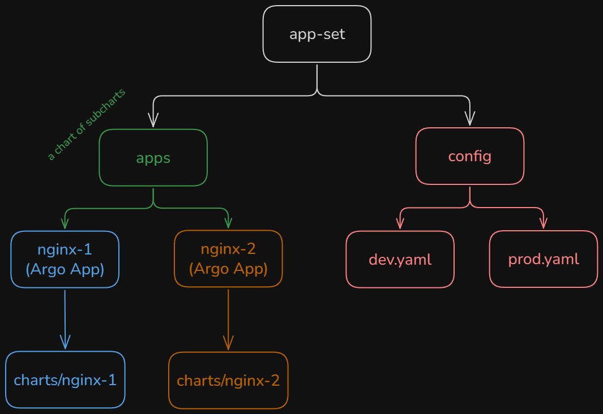

# Prerequisites

- [Kubectl](https://kubernetes.io/docs/tasks/tools/#kubectl) - used to interact with and manage the cluster.
- [kind](https://kind.sigs.k8s.io/docs/user/quick-start/#installation) - used to create a new cluster in containers.
- [Helm](https://helm.sh/docs/intro/install/)
- [ArgoCD install docs](https://argo-cd.readthedocs.io/en/stable/operator-manual/installation/) - for reference.
- [Tools similar to kind](https://kubernetes.io/docs/tasks/tools/) - this is just for reference but if you want to use another tool, you will have to edit the `install.sh` script, create your own, or just use the relevant bash commands.

# Why an App Set

This Argo App Set is using the [git generator](https://argo-cd.readthedocs.io/en/stable/operator-manual/applicationset/Generators-Git/).

The point of the App Set is to deploy it once in the 'prod' and/or 'dev' namespace. After that, if you want to make changes to the config of your 'prod' or 'dev' apps, you can update the values in the config folder. For simplicity, all of the code here is provided in a single repo. The point is to separate the App Set code, the Apps code and the Config code in separate repos. In this way you can control access to the different repos and easily create new environments. The drawback is that you get a complicated setup that requires a bit of time to wrap your head around. There are other considerations that you need to make for which you should read the ArgoCD docs.

# Set Up ArgoCD

Get a list of all available commands for reference:

```bash
./install.sh -h
```

Create a local Kind cluster:

```bash
./install.sh --create-local-kind-cluster
```

Install ArgoCD in the cluster:

```bash
 ./install.sh --install-argocd
```

Get the ArgoCD login credentials:

```bash
./install.sh --get-argocd-credentials
```

Port-forward to the ArgoCD server, access the ArgoCD UI and loging using the credentials from the previous step:

```bash
./install.sh --port-forward-to-argocd-server
```

# Set Up the App Set

Install the App Set in a 'prod' or a 'dev' namespace:

```bash
./install.sh --install-app-set <dev|prod>
```

## App Set Hierarchy



# Cleanup

Destroy the cluster:

```bash
./install.sh --delete-local-kind-cluster
```
