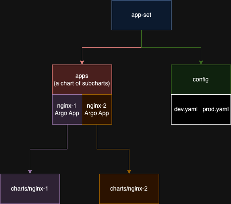

# Prerequisites

- [Kind](https://kind.sigs.k8s.io/docs/user/quick-start#installation) - or another tool for installing K8s on your machine
  - If you end up using another tool, skip the `install-k8s-with-kind` make target.
- [Kubectl](https://kubernetes.io/docs/tasks/tools/#kubectl)
- [Helm](https://helm.sh/docs/intro/install/)

# Reasoning Behind this App Set Installation

This Argo app set is using the `git` [generator](https://argocd-applicationset.readthedocs.io/en/stable/Generators-Git/). The code has been designed so that you have to install the app set once and you do not have to manage the Argo apps or the app set further. You will only have to change the apps' config in the `config` folder.

# Installation

```bash
# Install K8s with Kind, Argo CD, and the example Application Set
make install-k8s-with-kind
make install-argocd
make install-app-set ENVIRONMENT=dev
make install-app-set ENVIRONMENT=prod

# Access Argo CD
# This command will also print the username and password
make port-forward-argocd

# Delete the K8s cluster
make delete
```

# App Set Hierarchy


